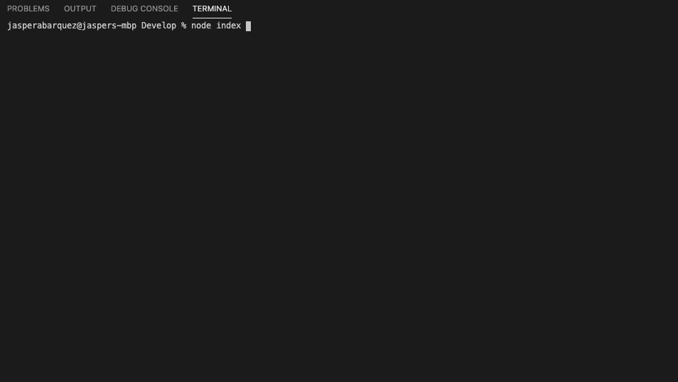

# Read Me Generator

# Desctiption
For this application, we created a javascript file that created a markdown file. This was accomplished by using node.js and inquirer.

# Table of Contents
  * [Installation](#Installation)
  * [Usage](#Usage)
  * [License](#License)
  * [Screenshot](#Screenshot)
  * [Questions](#Questions)

# Installation
This project was created using 'node.js' Make sure to have node.js installed before moving forward.

To learn how to install Node, [Click Here](https://nodejs.org/en/download/package-manager/).


Next you will need to install inquirer. To do so type in the following commands into your terminal.

```bash
npm i inquirer
```

To install necessary files, make sure your directory is changed to the 'Develop' folder.

Open up Terminal and type in the following command:

```bash
npm i install
```
The package.json files included in this repository will let you install the necessary information to run the application.

# Usage
To run the application, use Terminal to open the 'Develop' folder followed by:

```bash
node index.js
```
Follow the prompts, and the markdown file should be created in your 'utils' folder when finished!
# License

[](https://kuyajasper.mit-license.org)


# Screenshot



# Questions

Reach out at:

[](https://github.com/KuyaJasper)

[](mailto:abarquezj1@gmail.com)

